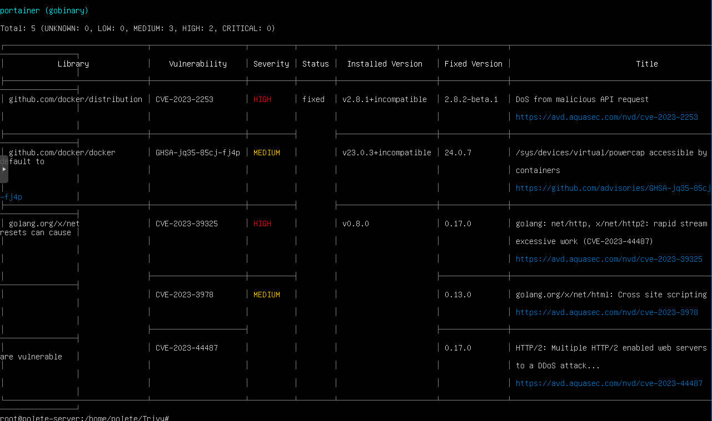
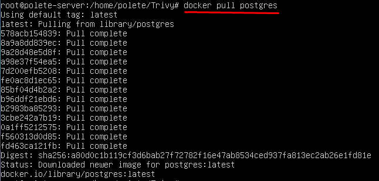
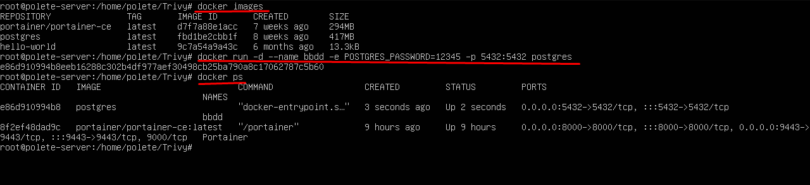
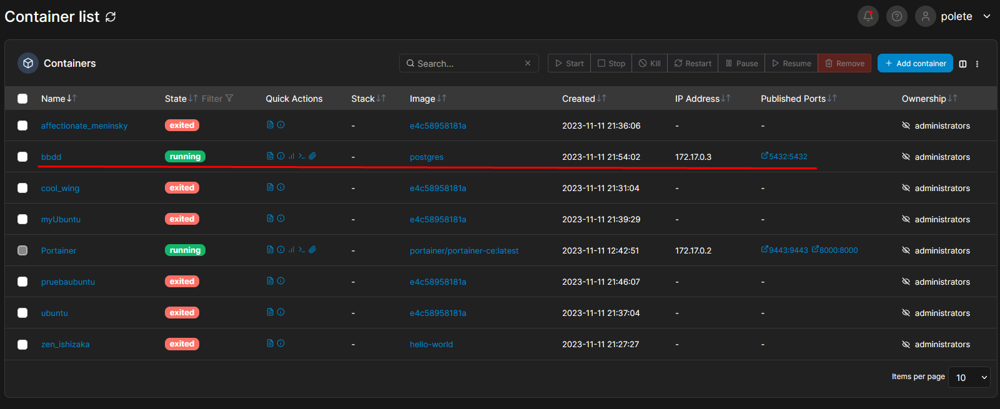
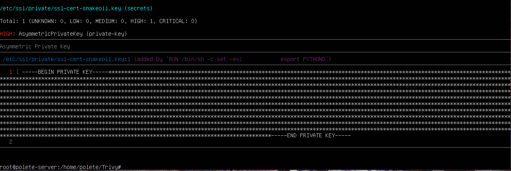
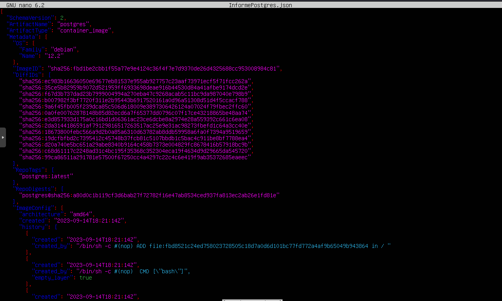

*Para esta prueba usaremos Ubuntu Server 22.04.2 y Portainer.io, una herramienta web open-source que nos permite administrar contenedores Docker de forma más visual y sencilla.* 

**La prueba empieza a partir de tener instalado correctamente Trivy en nuestro sistema**

## Ejemplo 1 (Portainer)

Vamos a escanear la imagen de portainer con Trivy:

trivy image [nombre_imagen] 

En este caso al tener portainer ya instalado y esta corriendo, he escaneado la imagen de Portainer:

**trivy image portainer/portainer-ce:latest**

El resultado es el siguiente:

Nos muestra un formato de tabla dónde nos saca las vulnerabilidades con su severidad, versión, título, etc.

## Ejemplo 2 (PostrgreSQL)

Vamos a instalar la imagen de PostgreSQL para montar una BBDD.

1. Descargamos el contenedor:

2. Comprobamos que la imagen se ha descargado correctamente y ejecutamos el contenedor:

Ejecutamos el contenedor:

Comprobamos desde Portainer si esta corriendo correctamente:

Ejecución del escaneo de imagen con Trivy:

Podemos ver algunos de los resultados del reporte del escaneo:

Al final del reporte nos muestra este mensaje:

Esto es cierto ya que la contraseña que he configurado de acceso es muy débil, y nos muestra el error.

# Sacar un reporte del escaneo realizado

Si queremos tener un reporte con los resultados de los findings del escaneo debemos escribir el siguiente comando:

**trivy image --format table -o Informe.txt nombre_imagen**

## Tabla

El resultado es exportado a un archivo .txt y lo abrimos con un editor de texto:

## JSON

Para sacar los resultados del escaneo en un archivo .json debemos escribir el siguiente comando:

**trivy image --format json -o Informe.json nombre_imagen**

Podemos sacar un reporte con los siguientes parámetros para que nos lo exporte en cierto formato:

1. table
2. json
3. template
4. sarif
5. cyclonedx
6. spdx
7. spdx-json
8. github
9. cosign-vuln

