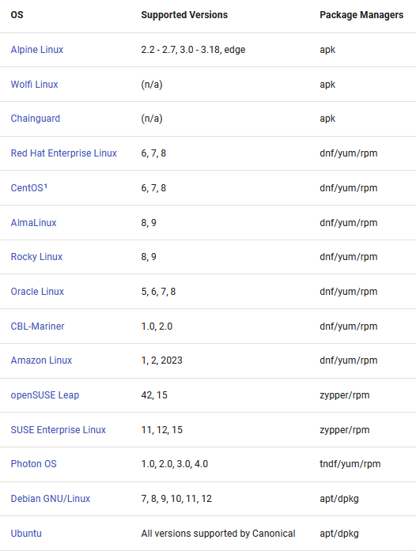
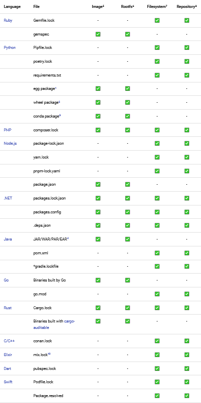
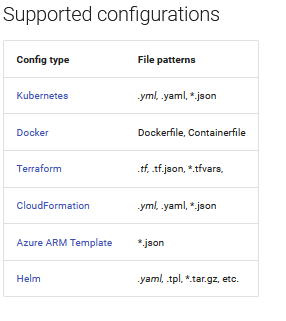
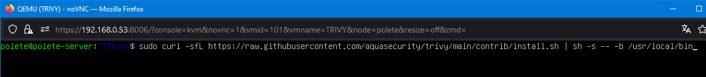

# ¿Qué es Trivy?

Es un escáner Open Source el cual busca problemas de seguridad y vulnerabilidades en varios objetivos. Los objetivos que Trivy puede escanear son:

1. Imágenes de contenedores
2. Sistemas de archivos
3. Repositorios GIT (Remoto)
4. Imágenes de VM (Máquinas Virtuales)
5. Kubernetes
6. Entornos AWS

## Coberturas de escaneo de Trivy

Trivy es capaz de escanear los lenguajes de programación más populares, sistemas operativos y plataformas comunes.

### Sistemas Operativos

Trivy puede escanear los siguientes sistemas operativos:

### Lenguajes de programación

Adicionalmente también puede escanear los siguientes lenguajes:

### Infraestructura como código (IaC)

También escanea archivos IaC (Infrastructure as Code):

**La infraestructura como código (IaC) es un proceso de gestión de la infraestructura de TI que aplica las prácticas recomendadas desde el desarrollo de software de **DevOps** hasta la gestión de los recursos de la infraestructura en la nube**

### Clúster de Kubernetes

Cuando Trivy escanea un clúster de Kubernetes sabe diferenciar entre:
- Una infraestructura de clúster (e.g: addons, kubelet, servidores api)
- Configuraciones de clúster (e.g: Roles, ClusterRoles)
- Cargas de trabajo de aplicaciones (e.g: nginx, sql)

Cada vez que se realiza un escaneo sobre estos recursos de Kubernetes, la imagen del contenedor se escanea por separado a la definición de recursos de Kubernetes (el archivo .YAML) que define el recurso del contenedor. 

Se escanea la imagen del contenedor para encontrar:
- Vulnerabilidades
- Desconfiguraciones
- Información expuesta

# Instalación y descarga en Linux

## Método 1

Para instalar Trivy en una distribución basada en Debian debemos hacer lo siguiente:

1. Acceder al repositorio indicado:  **etc/apt/sources.list.d
2. Añadir los siguientes comandos en la ruta indicada:
	sudo apt-get install wget apt-transport-https gnupg lsb-release
	
	wget -qO - https://aquasecurity.github.io/trivy-repo/deb/public.key | gpg --dearmor | sudo tee /usr/share/keyrings/trivy.gpg > /dev/null
	
	echo "deb [signed-by=/usr/share/keyrings/trivy.gpg] https://aquasecurity.github.io/trivy-repo/deb $(lsb_release -sc) main" | sudo tee -a /etc/apt/sources.list.d/trivy.list
	
	sudo apt-get update
	
	sudo apt-get install trivy

**Es posible que este método no funcione correctamente debido a que el documento que apuntamos en el segundo comando definido no está firmado y nos puede dar error.**

Para más información visitar la siguiente web:

https://github.com/aquasecurity/trivy

## Método 2 (Más fácil y rápido)

Si el método anterior os da error podéis probar con este ya que es más sencillo y rápido de ejecutar..

Este método también sirve para instalar Trivy en una distribución basada en Debian.

1. Otorgar permisos de lectura, escritura y ejecución en la siguiente ruta:

 
 /usr/local/bin

 
2.  Seguidamente escribimos el siguiente comando para instalar Trivy desde un repositiorio de Github:

**sudo curl -sfL https://raw.githubusercontent.com/aquasecurity/trivy/main/contrib/install.sh | sh -s -- -b /usr/local/bin

3. Ejecutamos el comando: **trivy**

Ya tenemos la herramienta instalada en nuestro sistema

